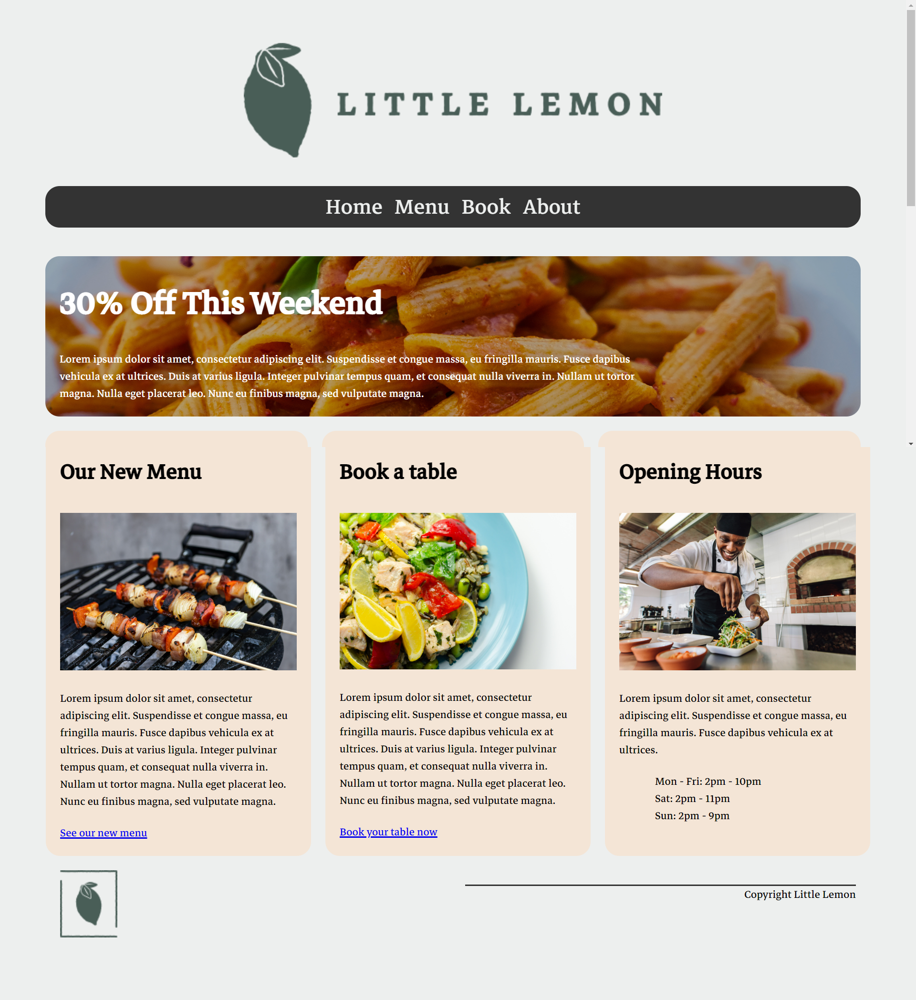

# Little Lemon - HTML and CSS Home Page

This project is a home page created as part of the Meta course on Coursera. The goal was to replicate the design provided in the example mockup.

## Project Overview

- **Course**: Meta Course on Coursera
- **Project**: HTML and CSS Home Page
- **Example Mockup**: `little-lemon-mockup.png`
- **My Result**: `my-little-lemon-result.png`

## Example Mockup

Here is the example mockup provided for the project:

## My Result

Here is the result of my implementation:

## Technologies Used

- HTML
- CSS

## How to Run

1. Clone the repository.
2. Open `index.html` in your web browser.

## Acknowledgements

- Thanks to Meta and Coursera for providing the course and project guidelines.
